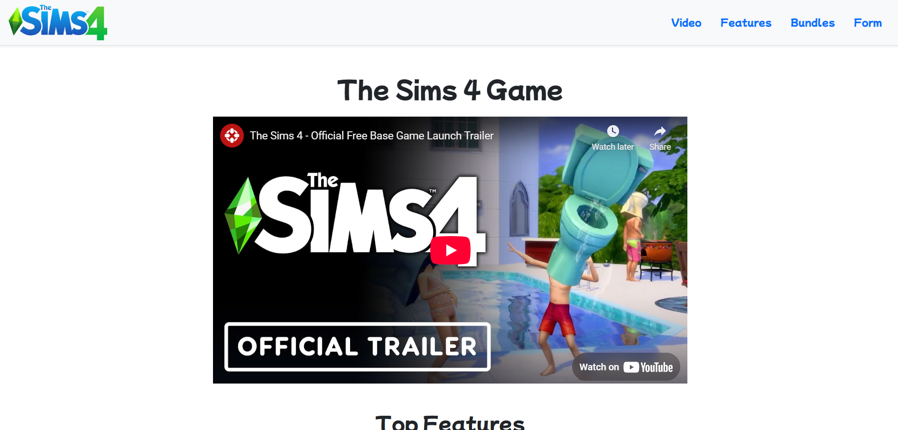
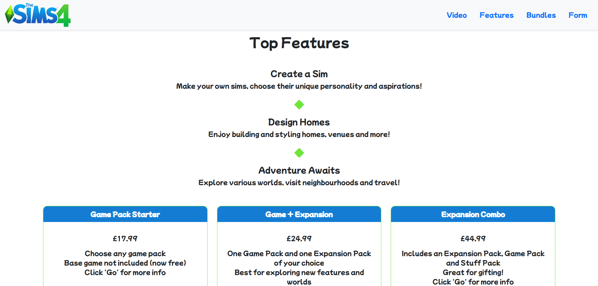
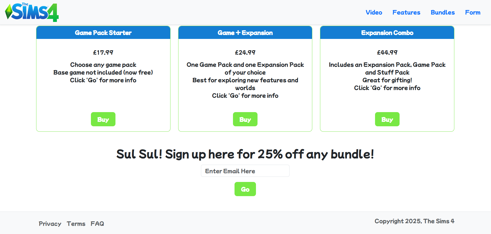
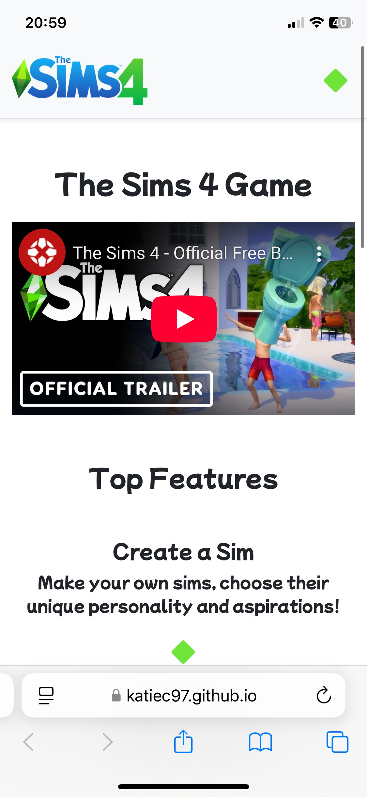
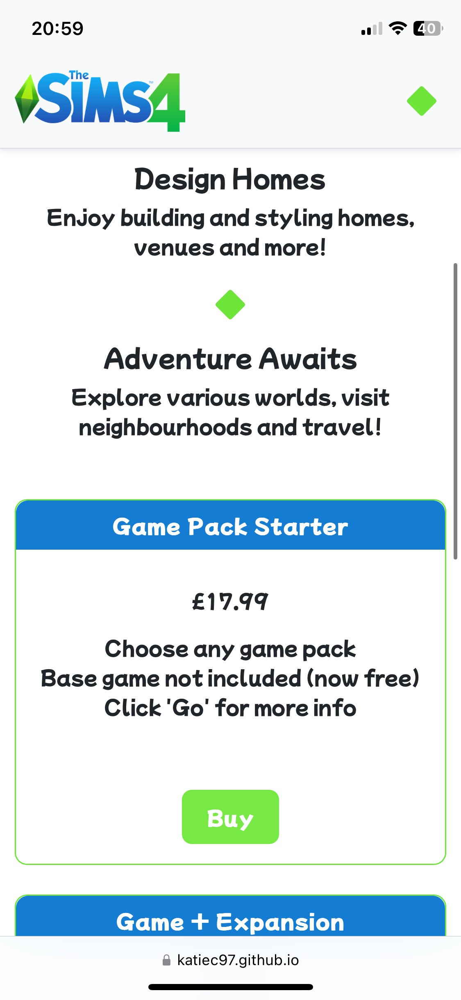
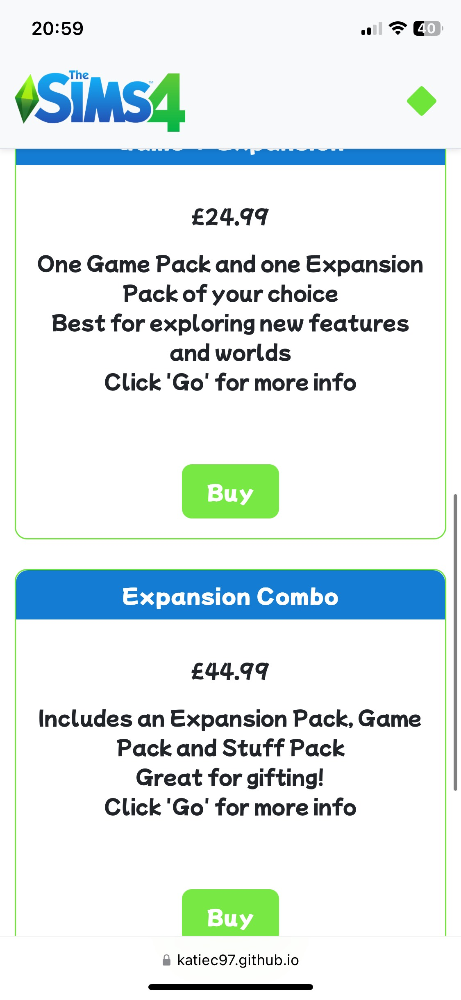
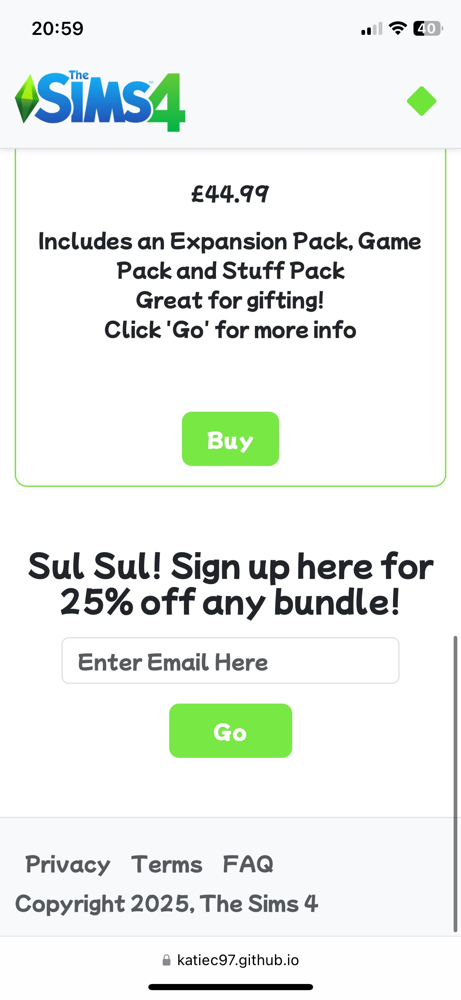

# Sims 4 Product Landing Page

A responsive and modern product landing page inspired by _The Sims 4_, rebuilt using **Bootstrap 5** with custom JavaScript and Font Awesome integration.

## Features

- Responsive layout using Bootstrap grid and utilities
- Font Awesome icons for styling and visual consistency
- Smooth scrolling and Scrollspy navigation
- Email signup form with JavaScript validation
- Interactive bundle cards with hover effects
- Custom styling with minimal CSS
- Navigation bar that's mobile-friendly (hamburger style/Sims-style diamond)

## Technologies Used

- HTML5
- CSS3 (minimal custom CSS)
- Bootstrap 5
- Vanilla JavaScript
- Font Awesome
- Google Fonts (`Mochiy Pop One`)

## Live Demo

[View the live site here](https://katiec97.github.io/the-sims-product-landing-page/)

## Screenshots

### Desktop View





### Mobile View






## Getting Started

1. Clone the repo:

```bash
git clone git@github.com:your-github-username/sims-landing-page.git
```
